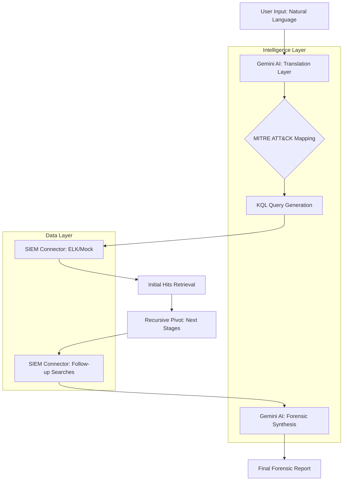

# Aegis Hunter: Technical Documentation & Integration Guide

## 1. Project Overview
**Aegis Hunter** is a recursive AI-driven threat hunting engine designed to automate the process of translating natural language threat hypotheses into actionable SIEM queries and forensic reports. It leverages the **MITRE ATT&CK** framework to pivot through attack stages, simulating the workflow of a senior security analyst.

---

## 2. Workflow & Architecture

### 2.1. System Workflow (Mermaid)


### 2.2. Component Description
- **Frontend (React):** Provides a "Google SecOps" inspired dashboard for initiating hunts, visualizing attack trees, and reviewing forensic reports.
- **Backend (Express):** Orchestrates the hunt logic, manages SIEM connections, and serves the Scenario Vault.
- **Intelligence Layer (Gemini-3-Flash):** Handles the translation of natural language to KQL and the synthesis of raw logs into a professional report.
- **SIEM Connectors:** An extensible interface for querying various log sources (currently supporting Mock and ELK).

---

## 3. Technical Implementation

### 3.1. Frontend Orchestration (`src/App.tsx`)
The frontend manages the state of the hunt and interacts with the Gemini API directly for translation and reporting.
- **Translation:** Converts user prompts (e.g., "Find suspicious powershell") into a MITRE ID (e.g., `T1059.001`) and a KQL query.
- **Recursive Hunt:** Calls the backend `/api/hunt` endpoint to perform multi-stage pivots based on the identified MITRE technique.
- **Visualization:** Renders complex "Attack Trees" using a custom recursive component that stacks tactics/techniques vertically while chaining stages horizontally.

### 3.2. Backend Orchestration (`server.ts`)
The server acts as the bridge between the AI and the data.
- **Scenario Vault:** Loads `scenarios.json` which contains the logic for "Next Stages" (e.g., if PowerShell is found, look for Scheduled Tasks).
- **Hunt API:** Iterates through the `next_stages` of a technique and queries the SIEM for each.

### 3.3. SIEM Connector Interface (`siem-connectors.ts`)
A standardized interface for data retrieval.
- **`SiemConnector` Interface:** Defines the `search` method.
- **`ElasticSearchConnector`:** Implements real-time lookups against an ELK instance using the REST API.
- **`MockSiemConnector`:** Provides a deterministic environment for testing and demos.

---

## 4. Script Documentation (Annotated)

### 4.1. `siem-connectors.ts` (The Integration Layer)
```typescript
// Standard log format used across the application
export interface SiemLog {
  "@timestamp": string;
  host: { name: string };
  user: { name: string };
  process: { name: string; command_line: string };
  event: { category: string; action: string };
}

// Interface for adding new SIEMs (Splunk, Sentinel, etc.)
export interface SiemConnector {
  name: string;
  search(query: string): Promise<SiemLog[]>;
}

// ELK Implementation using query_string for maximum flexibility
export class ElasticSearchConnector implements SiemConnector {
  async search(query: string): Promise<SiemLog[]> {
    // Performs a POST request to the _search endpoint
    // Uses ApiKey authentication for security
    const response = await fetch(`${this.url}/${this.index}/_search`, {
      method: 'POST',
      headers: { 'Authorization': `ApiKey ${this.apiKey}` },
      body: JSON.stringify({
        query: { query_string: { query: query } }
      })
    });
    // ... returns mapped ECS-compliant logs
  }
}
```

### 4.2. `server.ts` (The Orchestrator)
```typescript
// The Hunt API: The core logic of Aegis Hunter
app.post("/api/hunt", async (req, res) => {
  const { mitre_id } = req.body;
  
  // 1. Look up the technique in the Scenario Vault
  if (scenarios[mitre_id]) {
    // 2. Iterate through "Next Stages" defined in the vault
    for (const stage of scenarios[mitre_id].next_stages) {
      // 3. Perform the pivot search against the configured SIEM
      const hits = await siem.search(stage.query);
      if (hits.length > 0) {
        // 4. Collect evidence for the forensic report
        context.follow_ups.push({ stage: stage.stage, hits });
      }
    }
  }
  res.json(context);
});
```

---

## 5. SIEM Integration Guide (ELK)

To connect a live ELK instance, configure the following environment variables in the AI Studio Secrets panel:

| Variable | Description | Placeholder |
| --- | --- | --- |
| `SIEM_TYPE` | Set to `elk` to enable live lookups | `elk` |
| `ELASTICSEARCH_URL` | The base URL of your ES instance | `[PLACEHOLDER_ELK_URL]` |
| `ELASTICSEARCH_API_KEY` | Your ES API Key | `[PLACEHOLDER_ELK_API_KEY]` |
| `ELASTICSEARCH_INDEX` | The index pattern to search | `[PLACEHOLDER_ELK_INDEX]` |

---

## 6. Master Prompt for Future Agents
**Use the following prompt when handing off this project to another AI agent for further development:**

> "You are working on **Aegis Hunter**, a recursive AI threat hunting engine. 
> 
> **Core Architecture:**
> - **Frontend:** React + Gemini-3-Flash (Translation & Reporting).
> - **Backend:** Express + SIEM Connector Interface.
> - **Data:** MITRE ATT&CK mapped scenarios in `scenarios.json`.
> 
> **Key Rules for Edits:**
> 1. **Extensibility:** When adding new SIEMs, implement the `SiemConnector` interface in `siem-connectors.ts`.
> 2. **Intelligence:** The `scenarios.json` file is the source of truth for attack chaining. Update it to add new hunting logic.
> 3. **UI Consistency:** Follow the 'Google SecOps' aesthetic (dark mode, monospace fonts, high-density data).
> 4. **Safety:** Never expose API keys in the client-side code; use the backend proxy for sensitive SIEM lookups.
> 5. **Visualization:** The `renderAttackTreeNode` in `App.tsx` is a recursive component. Maintain the vertical-stack/horizontal-chain layout for readability."

---

## 7. Future Roadmap
- [ ] **Splunk Connector:** Implement `SplunkSiemConnector` using the Splunk HEC or REST API.
- [ ] **Graph Visualization:** Replace the tree view with a dynamic D3.js force-directed graph for complex multi-path attacks.
- [ ] **Automated Remediation:** Add a "Remediate" button that generates PowerShell/Bash scripts for containment.
